## BloomRender 操作手冊

---

## 1. 文字生圖：從文字描述到示意圖

### 1.1 輸入提示詞（Prompt）

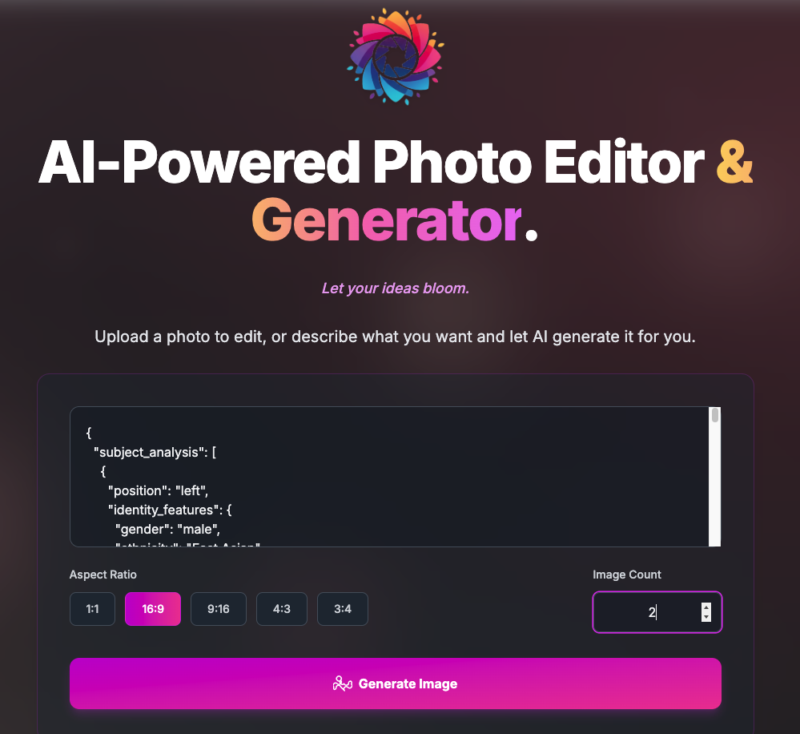

- **範例提示詞**:

```
{
  "subject_analysis": [
    {
      "position": "left",
      "identity_features": {
        "gender": "male",
        "ethnicity": "East Asian",
        "estimated_age": "late 20s to early 30s",
        "facial_features": {
          "shape": "oval with defined jawline",
          "eyes": "dark brown, almond-shaped, subtle double eyelids",
          "eyebrows": "thick, dark, naturally arched",
          "facial_hair": "neatly groomed full beard and mustache, short stubble length",
          "smile": "wide, showing upper teeth, friendly expression"
        },
        "hair_style": {
          "color": "black",
          "cut": "modern side-part, medium length on top",
          "styling": "slicked back with natural volume, slightly wavy texture"
        }
      },
      "attire": {
        "outerwear": "single-breasted dark chocolate brown suit blazer",
        "shirt": "crisp white dress shirt, open collar, no tie",
        "details": "lapel pin on the left side"
      }
    },
    {
      "position": "right",
      "identity_features": {
        "gender": "male",
        "ethnicity": "East Asian",
        "estimated_age": "mid to late 20s",
        "facial_features": {
          "shape": "heart-shaped with prominent cheekbones",
          "eyes": "dark, bright, energetic gaze",
          "eyebrows": "sharp, well-defined, straight",
          "facial_hair": "clean-shaven",
          "smile": "confident, closed-mouth to slight toothy grin, visible dimples"
        },
        "hair_style": {
          "color": "dark brown/black",
          "cut": "short back and sides, longer fringe",
          "styling": "curtained hair / middle part (comma hair style), polished look"
        }
      },
      "attire": {
        "outerwear": "matching dark chocolate brown suit blazer (three-button style visible)",
        "shirt": "white dress shirt",
        "neckwear": "dark brown patterned silk tie",
        "details": "matching lapel pin on the left side"
      }
    }
  ],
  "scene_and_composition": {
    "shot_type": "medium shot, waist-up",
    "lighting": "natural daylight from a large window background, soft fill light on faces",
    "background": "airport tarmac visible through a large glass window, minimalist interior wall on the right",
    "color_palette": {
      "primary": ["#3D2B1F (Chocolate Brown)", "#FFFFFF (White)"],
      "secondary": ["#F5F5F5 (Soft Grey)", "#A9A9A9 (Tarmac Grey)"]
    },
    "atmosphere": "professional, formal, celebratory"
  }
}
```

- **步驟**：
  1. 進入首頁上方的 **「Generate Image」** 分頁。
  2. 在「Describe the image you want to create」文字框中輸入你想要的畫面，例如：
     - 「乾淨白底半身人像，適合履歷使用」
     - 「辦公室背景、自然光、微笑表情」
  3. 下方可調整：
     - **Aspect Ratio**：1:1、4:3、3:4、16:9、9:16
     - **Image Count**：一次生成 1～4 張圖。

> 建議：先用較寬鬆的描述生成一組示意圖，確認風格後再搭配證件照或編輯器做精緻化處理。

### 1.2 瀏覽生成結果

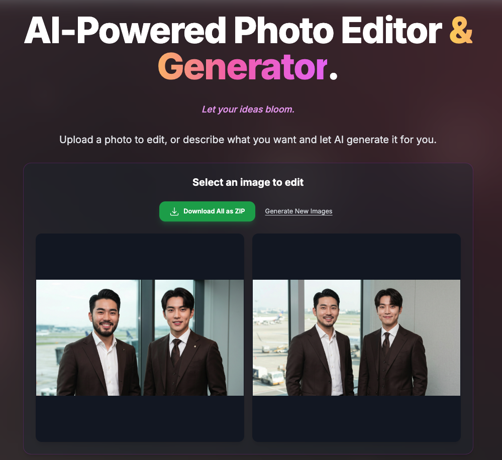

- 生成完成後，介面會顯示一組縮圖卡片：
  - 每張圖上可以：
    - **Download**：下載單張 PNG 圖片。
    - **Edit This**：將此圖直接送入主編輯器，做細部修圖。
  - 上方如同時生成多張，還會出現：
    - **Download All as ZIP**：將所有結果打包成 ZIP 下載。

- 若想重新嘗試不同風格：
  - 點選 **「Generate New Images」** 清除目前結果，重新輸入提示詞並生成新的一組圖片。

---

## 2. AI 證件照：從雜亂自拍到正式證件照

這一段示範如何把「背景雜亂、構圖不佳的自拍」，轉成**乾淨、合規格的證件照**。  
對應圖片檔案：`idphoto_0~6_*.png`。

### 2.1 問題範例：雜亂文字提示與結果

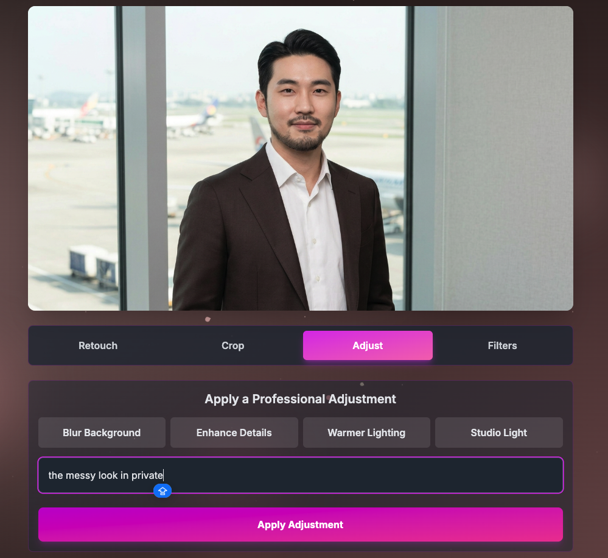
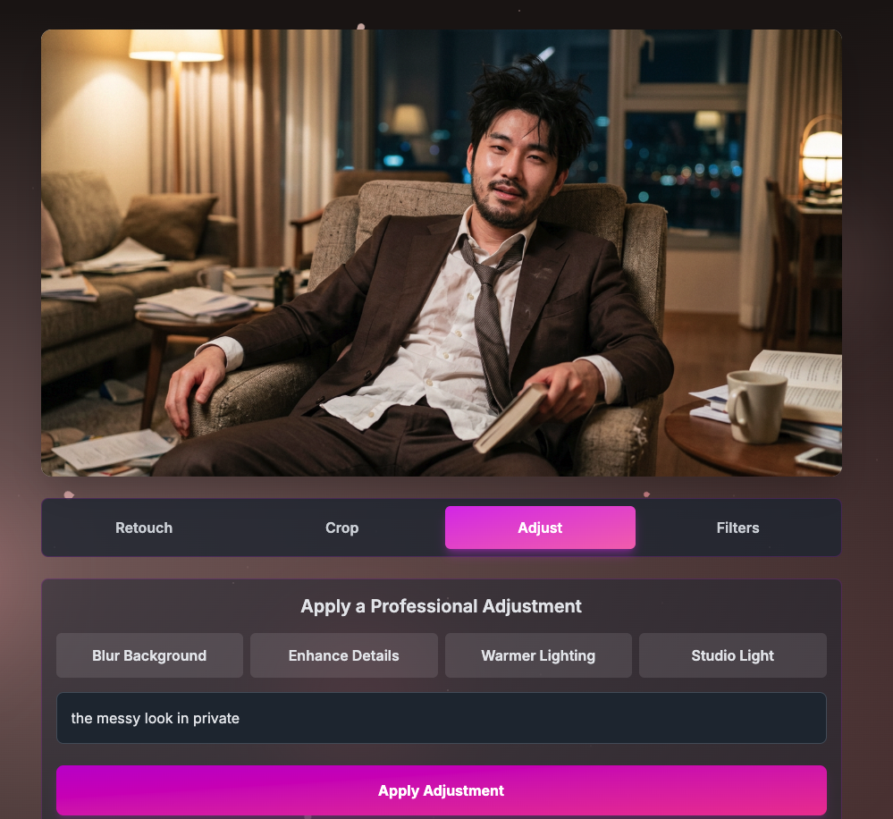

- 若在證件照流程中輸入過於**雜亂或含糊的描述**：
  - 可能會得到背景複雜、服裝不符合規範，或表情不適合證件的結果。
- 建議在 ID Photo 表單中，盡量使用結構化選項，而不是長篇自由文字。

### 2.2 常見錯誤：規格與輸出設定不一致

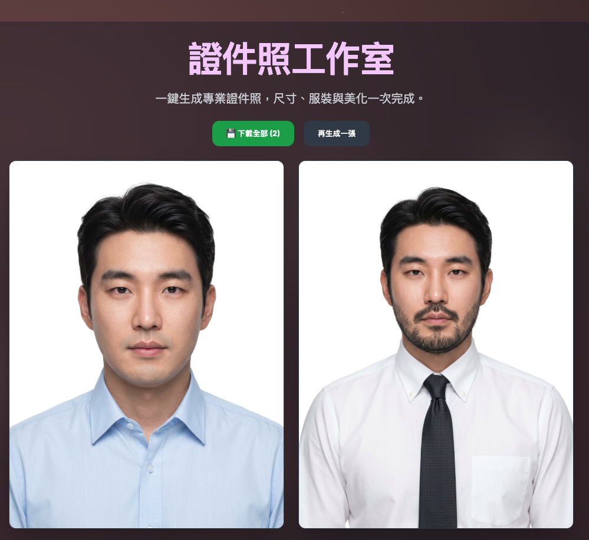

- 當「證件類型」「輸出規格」「服裝與修圖等級」設定彼此矛盾時：
  - 例如：選擇護照規格，但服裝或背景描述不符合官方要求。
  - 可能會導致輸出影像不符尺寸或構圖要求。
- 解決方式：
  - 優先使用 **欄位選單** 來指定：
    - 證件類型（例如：台灣身分證、美國簽證、履歷照…）
    - 修圖等級（自然 / 加強）
    - 背景顏色（白、藍、紅等標準色）
    - 服裝選項（自動西裝、自備照片等）

### 2.3 重新填寫規範清楚的表單

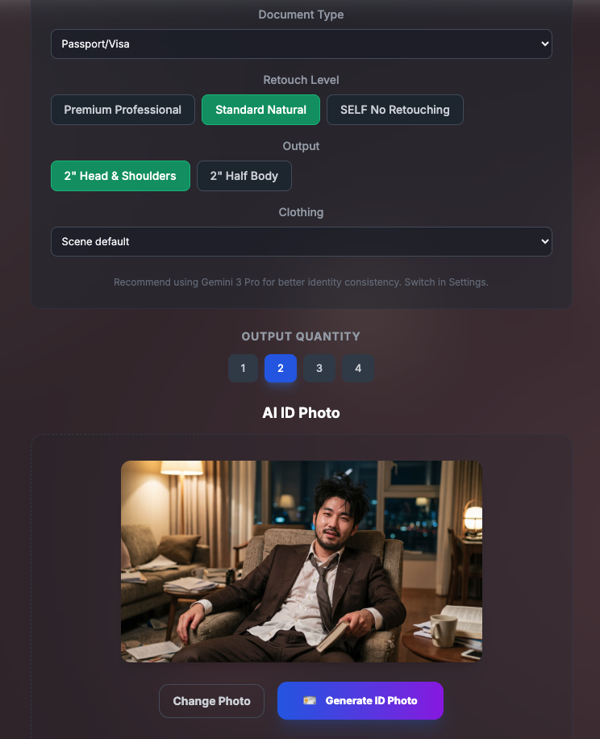

- 在 `IdPhotoForm` 中重新設定：
  1. **證件類型**：選擇實際要使用的證件規格。
  2. **修圖等級**：選擇「自然」或「適度美化」，避免過度修飾。
  3. **輸出規格**：選擇官方建議尺寸（例如 2x2 inch, 35x45 mm）。
  4. **服裝**：
     - 可以選擇自動套用西裝／襯衫，或
     - 上傳自備服裝參考照。

- 旁邊的提示文字會指引你：哪些欄位與官方規範最相關。

### 2.4 產出乾淨的人像底圖

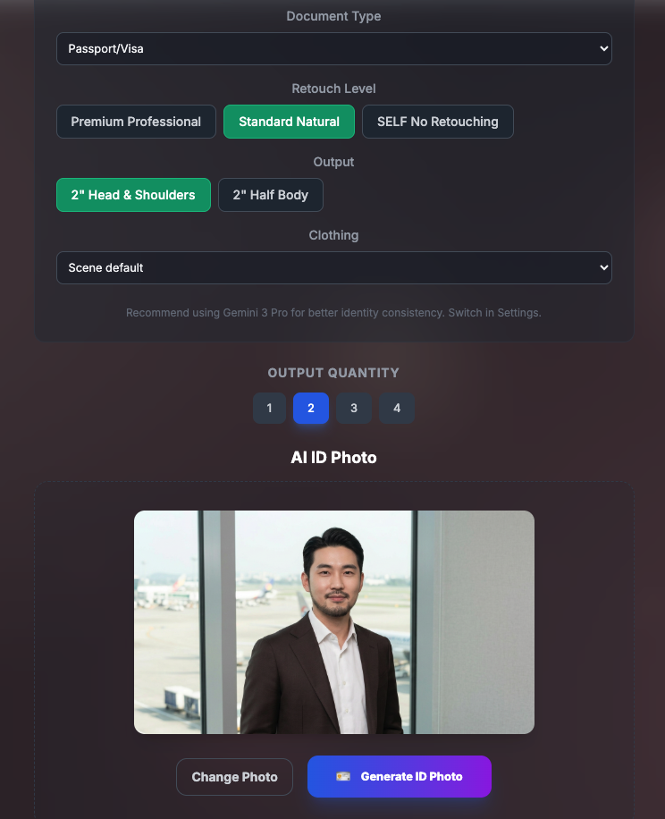

- 送出設定後，系統會產生**構圖正確、背景乾淨**的人像：
  - 背景符合所選顏色（多為白底或單色）。
  - 人物居中，臉部大小與位置接近官方規範。
- 這張圖可以作為後續裁切與排版的基底。

### 2.5 完整 ID Photo 排版輸出

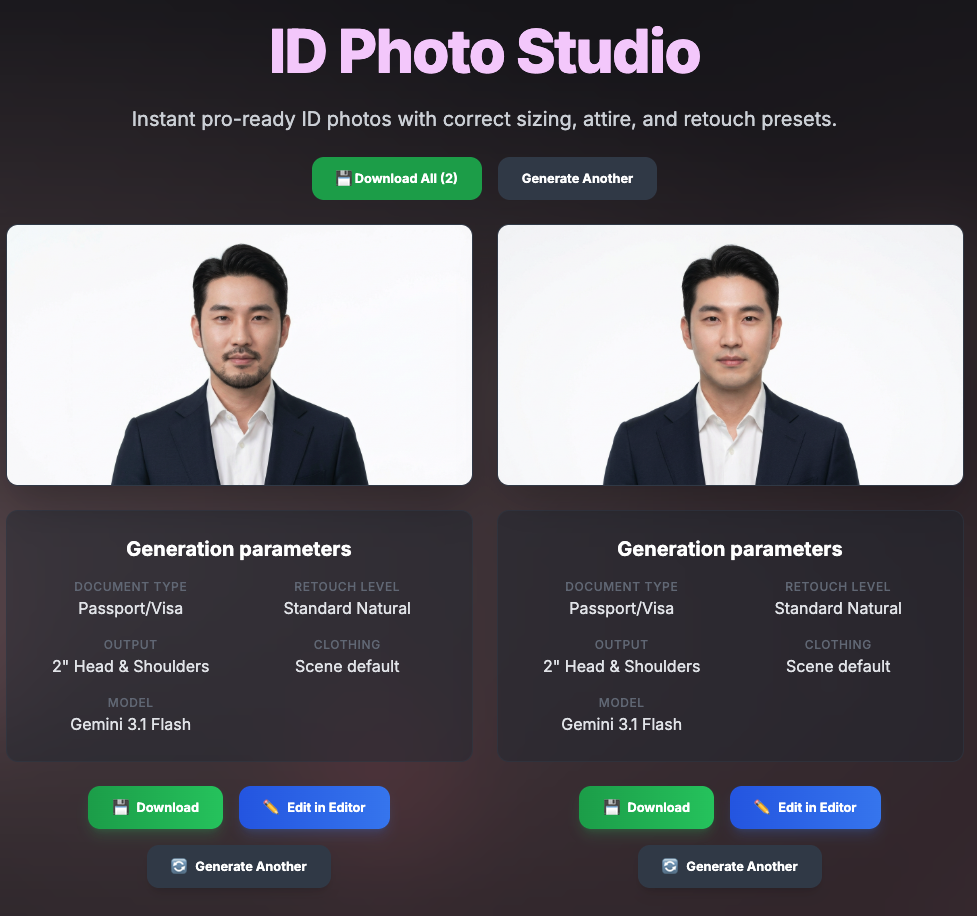

- 在 ID Photo 的最終結果頁，你會看到：
  - 多張依規格排版好的證件照（可直接印出）。
  - 旁邊顯示本次使用的設定（類型、尺寸、修圖等級、服裝…）。
- 下載方式：
  - 單張下載：點各張圖片下方的下載按鈕。
  - 批次下載：使用「Download All」或 ZIP 下載（依實作為準）。

---

## 3. 編輯器微調：最後的修飾

當你已經有一張滿意的 ID Photo 或一般照片，仍可進入主編輯器做最後微調。  
對應圖片檔案：`edit_1_prompt.png`、`edit_2_image.png`、`idphoto_6_edit.png`。

### 3.1 在編輯器輸入微調指令

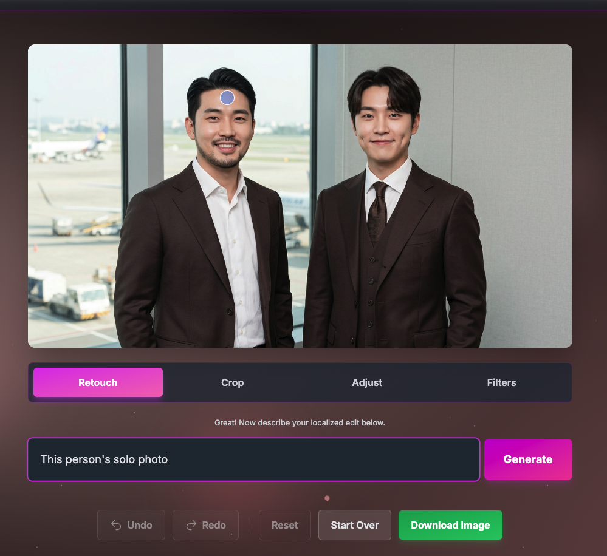

- 在主編輯器中，可以：
  - 使用「修圖」面板，輸入更精細的指令，例如：
    - 「柔和膚色，保留臉部細節」
    - 「稍微提亮眼睛與笑容，不要過度美肌」
  - 或使用畫筆／熱區（hotspot），只對特定區域進行處理。

### 3.2 查看微調後的成品

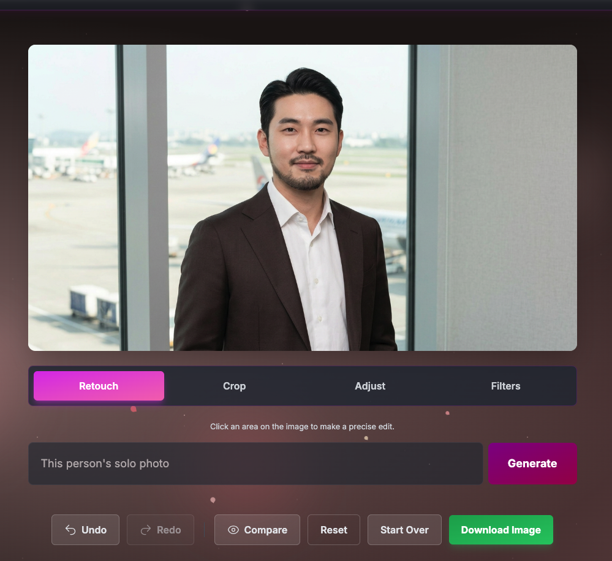

- 編輯器會顯示修圖前後的差異（可使用「比較原圖」功能）。
- 建議檢查：
  - 臉部細節是否自然、不過度磨皮。
  - 背景邊緣是否乾淨，沒有殘影或鋸齒。

### 3.3 將證件照送入編輯器做細節調整

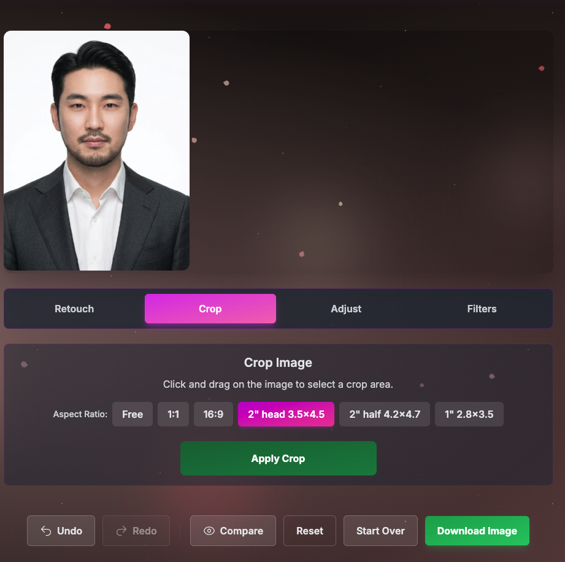

- 將前一節完成的 ID Photo 匯入編輯器後，可以：
  - 略為調整亮度與對比，使列印時更清晰。
  - 修掉衣領皺褶或小瑕疵。
  - 保持五官與臉型不變，以免違反審核規範。

> 小提醒：證件照的編修應以「清晰自然」為主，避免大幅改變輪廓或膚色。

---

## 4. AI 形象照（Portrait）：履歷與個人品牌照片

對應圖片檔案：`portrait_1_prompt.png`、`portrait_2_half.png`、`portrait_3_full.png`。

### 4.1 填寫形象照需求

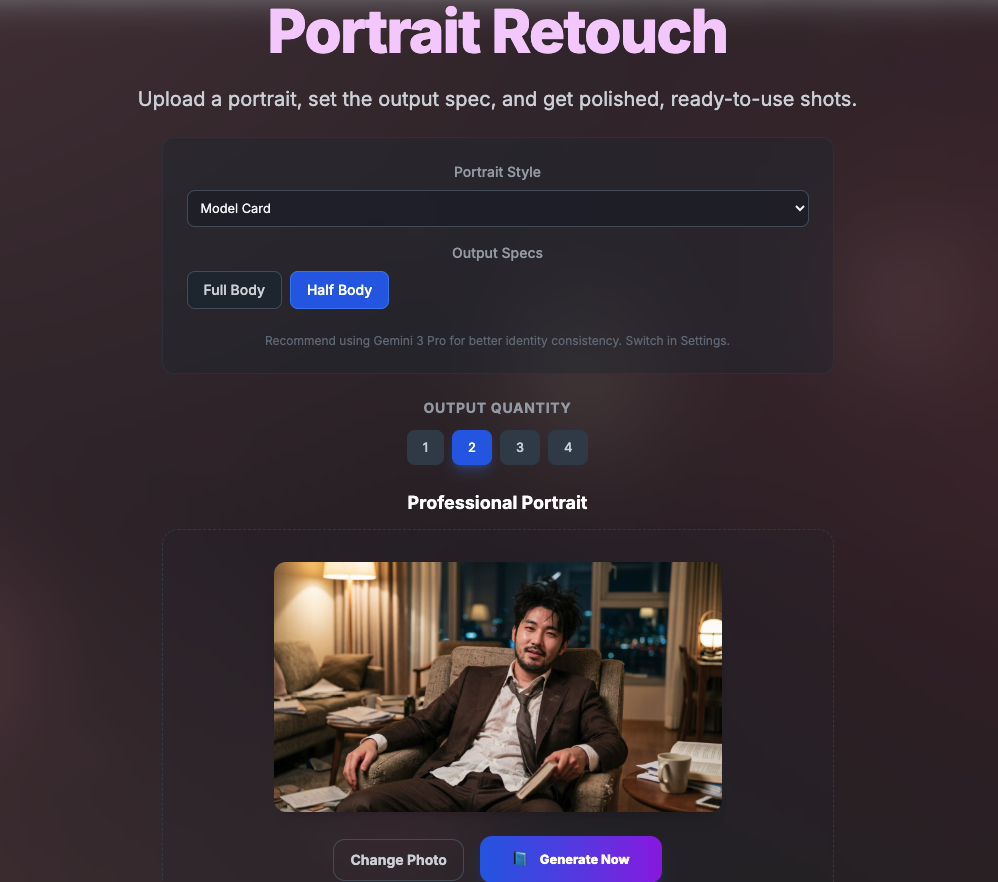

- 在 **Portrait** 分頁中，你可以：
  - 指定用途（履歷、個人品牌、社群頭像等）。
  - 選擇輸出規格（尺寸與比例）。
  - 視需要輸入簡短補充說明（例如「自然光、微笑、不過度美肌」）。
- 建議：
  - 用「用途 + 氛圍 + 光線」三要素描述即可，避免過長的故事性文字。

### 4.2 檢查半身預覽

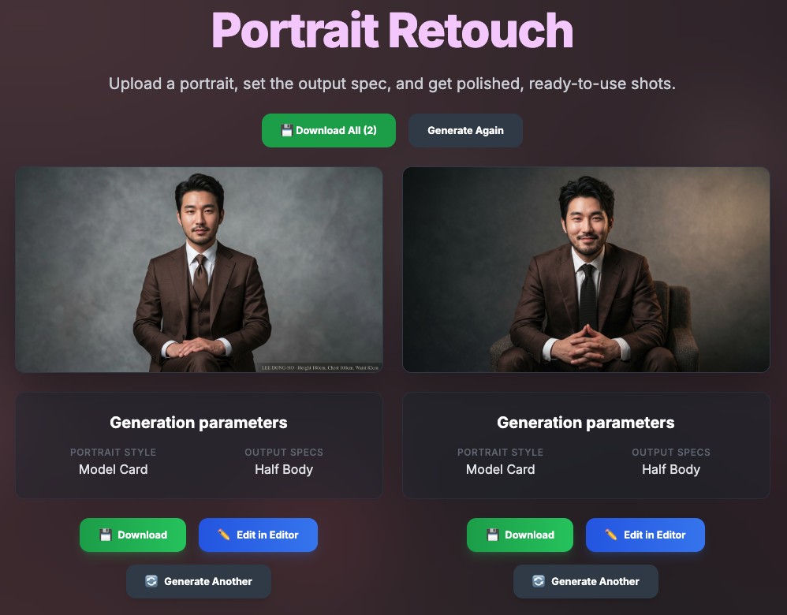

- 上傳照後，系統會顯示半身或近半身預覽：
  - 確認臉部是否居中、比例適合履歷或 LinkedIn 等場合。
  - 若構圖不理想，可重新上傳或改用編輯器進行裁切。

### 4.3 完整形象照成果

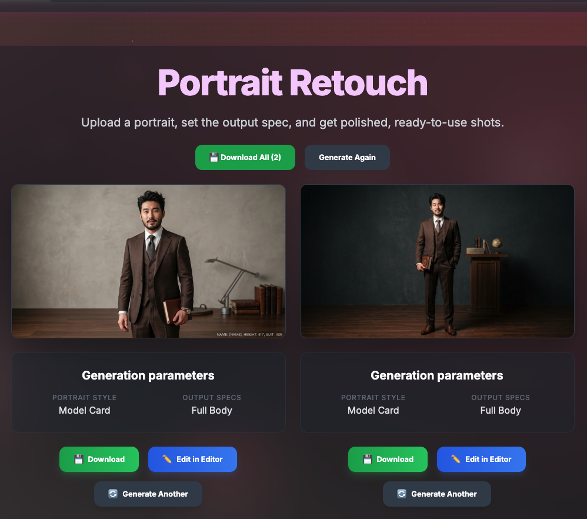

- 完成後可看到完整形象照結果：
  - 光線自然、背景乾淨，適合直接放入履歷或個人網站。
  - 下方會提供：
    - **下載**：直接存成 PNG。
    - **再次生成**：在相似設定下換一組表情或姿勢。
    - **送入編輯器**：進一步微調膚色、對比或背景。

---

## 5. AI 旅遊照（Travel）：世界與台灣場景

對應圖片檔案：`travel_0_girl.png`、`travel_1_map.png`、`travel_2_setting.png`、  
`travel_3_man.png`、`travel_4_group_set.png`、`travel_5_cuple_img.png`。

### 5.1 選擇旅遊主角與目標感覺

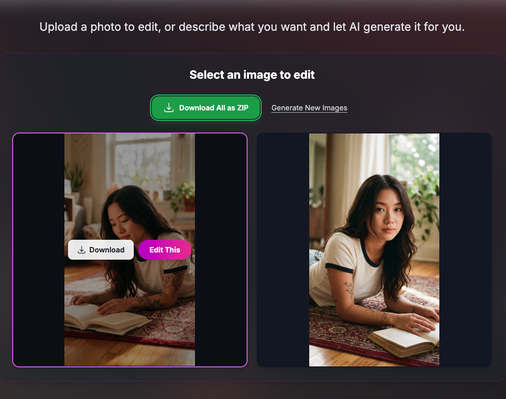

- 在 Travel 分頁中，你可以先決定：
  - 主角的風格（例如：背包客、城市旅人、情侶旅遊…）。
  - 想要的整體氛圍（寫實／明信片感／膠片風）。
- 這一步主要是幫助你在心中確立「想呈現的故事」。

### 5.2 使用地圖與表單設定場景

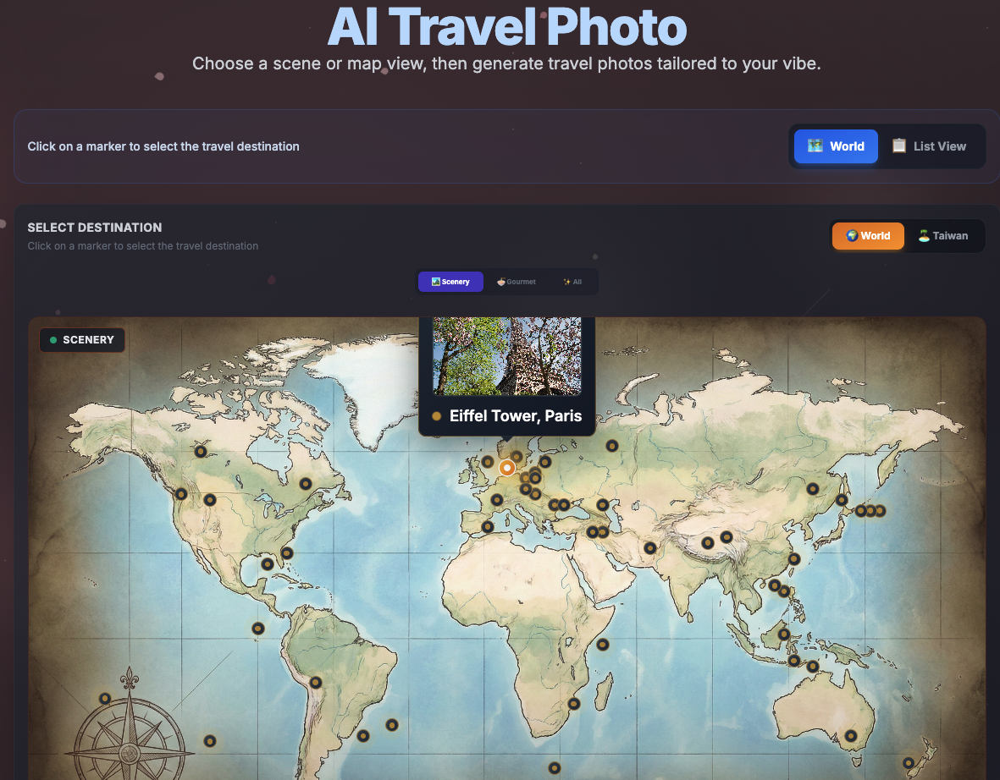

- 進一步使用地圖 + 表單組合：
  - 在世界地圖或台灣地圖上點選具體地點（城市、景點）。
  - 右側表單（對應 `TravelForm`）中可設定：
    - 天氣：晴天、陰天、黃昏、夜景等。
    - 時間：白天／黃昏／夜晚。
    - 服裝、姿勢、構圖（例如「半身、遠景、人景比例」）。

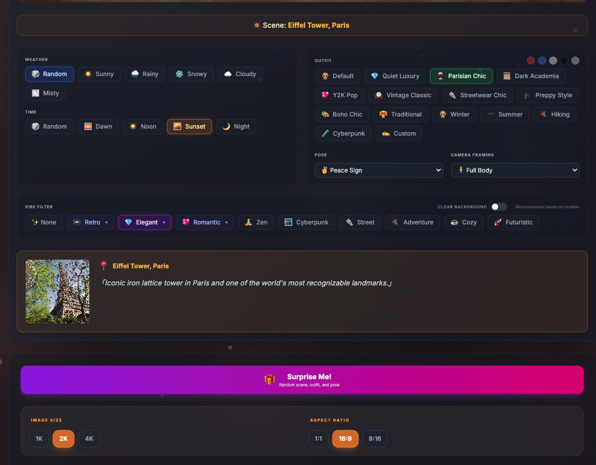

- 表單可進一步微調：
  - 氛圍（放鬆、浪漫、冒險…）。
  - 構圖偏好（人物大比例、多人合照、廣角景觀…）。

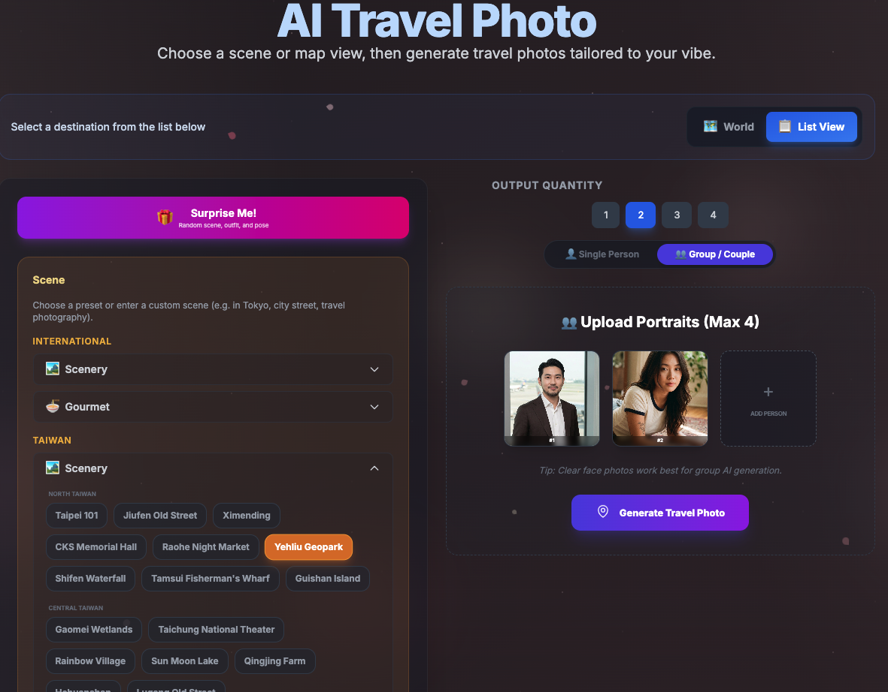

- 若是多人或情侶旅遊照，可以：
  - 指定人數與彼此關係（情侶、朋友、家庭）。
  - 設定是否需要並肩合照、自拍視角、他拍視角等。

### 5.3 產出單人、情侶與團體旅遊照

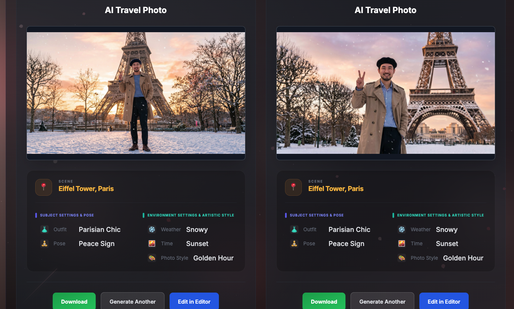

- 單人旅遊照會著重：
  - 人物與背景比例、景點辨識度。
  - 整體顏色與光線與所選天氣／時間一致。

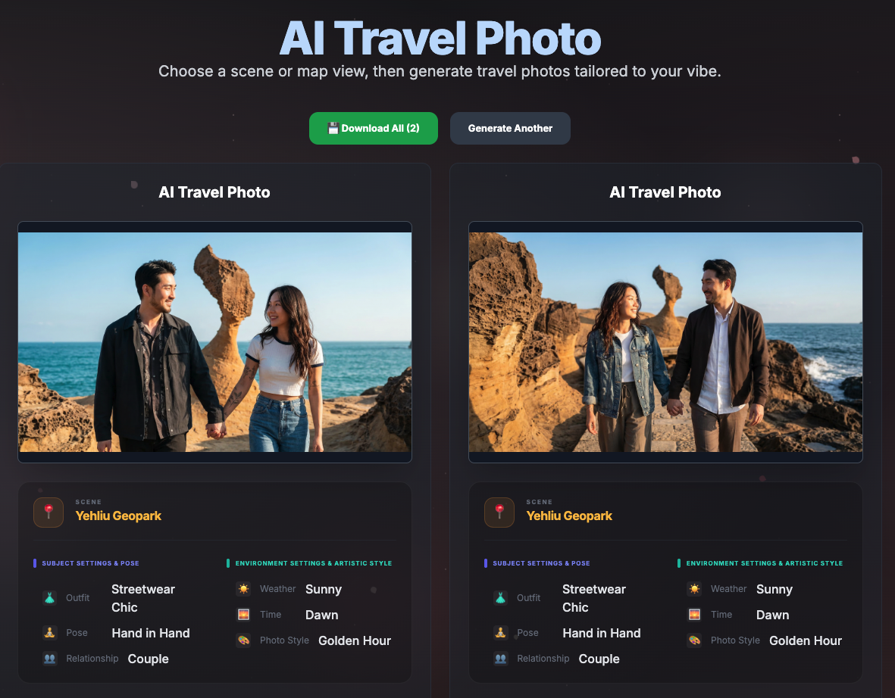

- 情侶或小團體旅遊照則會強調：
  - 人與人之間的互動感（牽手、對視、一起看風景）。
  - 依設定呈現浪漫或活潑的氛圍。
- 同樣支援：
  - 單張下載、批次下載。
  - 再次生成與送入編輯器。

---

## 6. AI 虛擬試穿（Try On）：人物 + 服裝組合

對應圖片檔案：`tryon_1_set.png`、`tryon_2_img.png`、`tryon_3_girl.png`、`tryon_4_girl_img.png`。

### 6.1 上傳人物與多套服裝

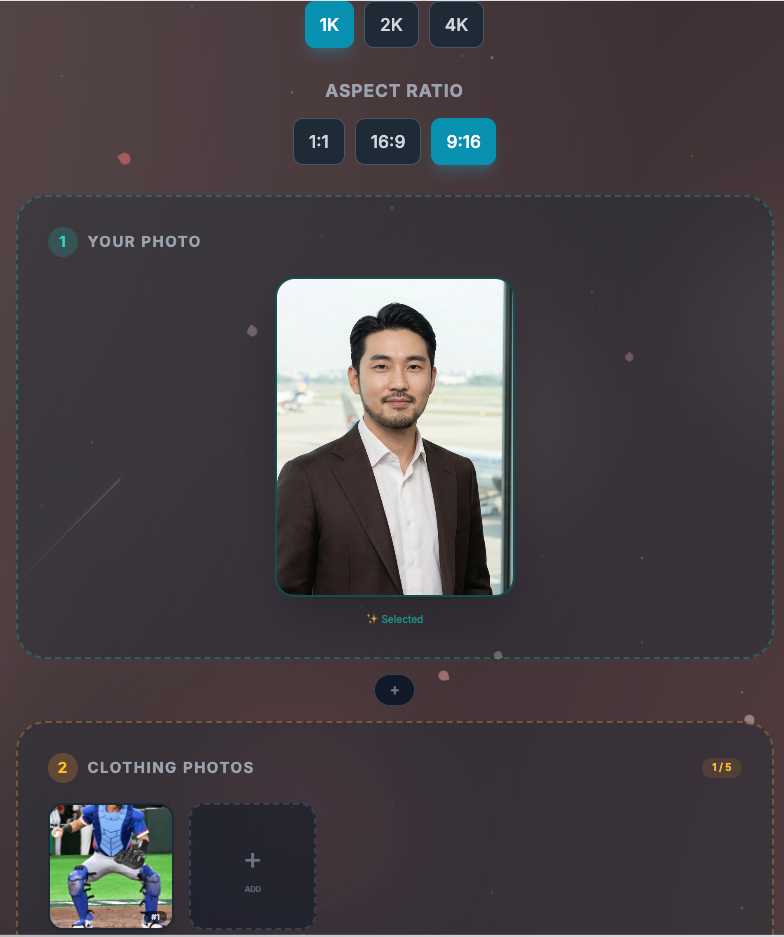

- 在 Try On 分頁中：
  - 左側上傳一張清晰的全身或半身人物照。
  - 右側可上傳多張服裝圖片（上衣、外套、洋裝等）。
  - 介面會提示可上傳的最少／最多件數，以及推薦尺寸比例。
- 建議：
  - 人物照背景保持簡單，光線均勻。
  - 服裝照盡量為正面、拉平拍攝，方便模型辨識。

### 6.2 瀏覽試穿結果與導出

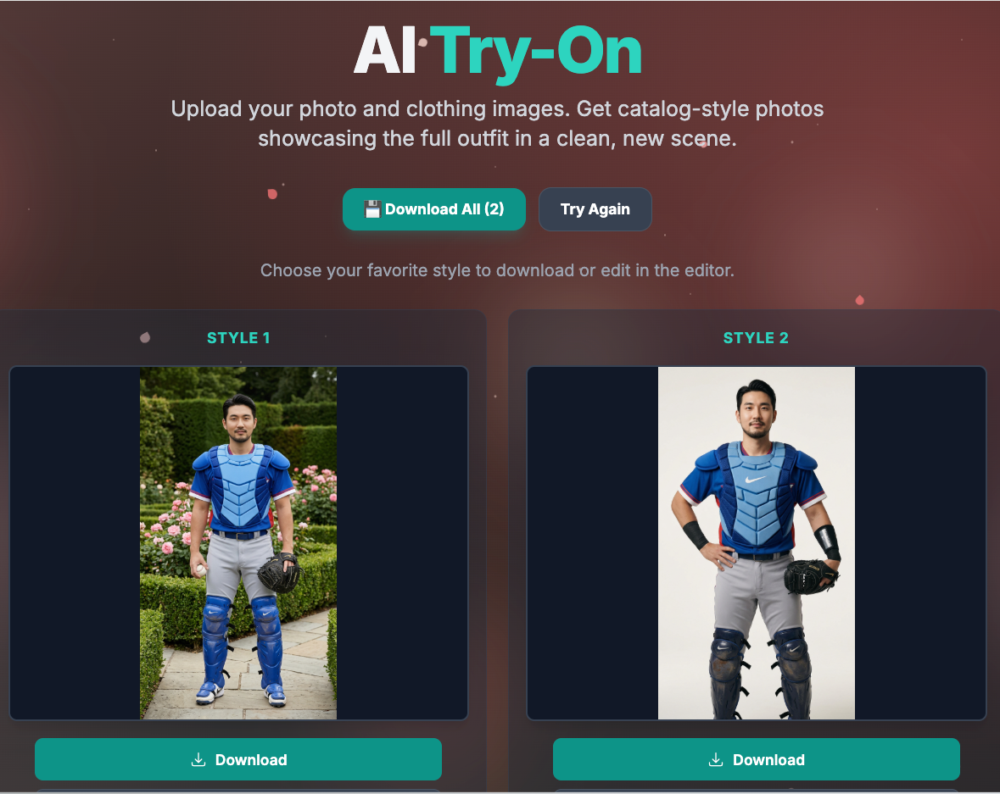

- 生成完成後，Try On 頁面會以卡片列表顯示不同服裝搭配：
  - 每張卡片代表一套試穿結果，可能包含：
    - 服裝名稱或風格標籤。
    - 下載按鈕。
    - 導入編輯器按鈕。
- 使用建議：
  - 先快速瀏覽所有卡片，挑出最符合實際穿搭感的幾張。
  - 對於有細部需求的結果，再送入編輯器做背景或光線微調。

### 6.3 女性示範流程：從單人照到兩套造型

#### 6.3.1 上傳人物與服裝

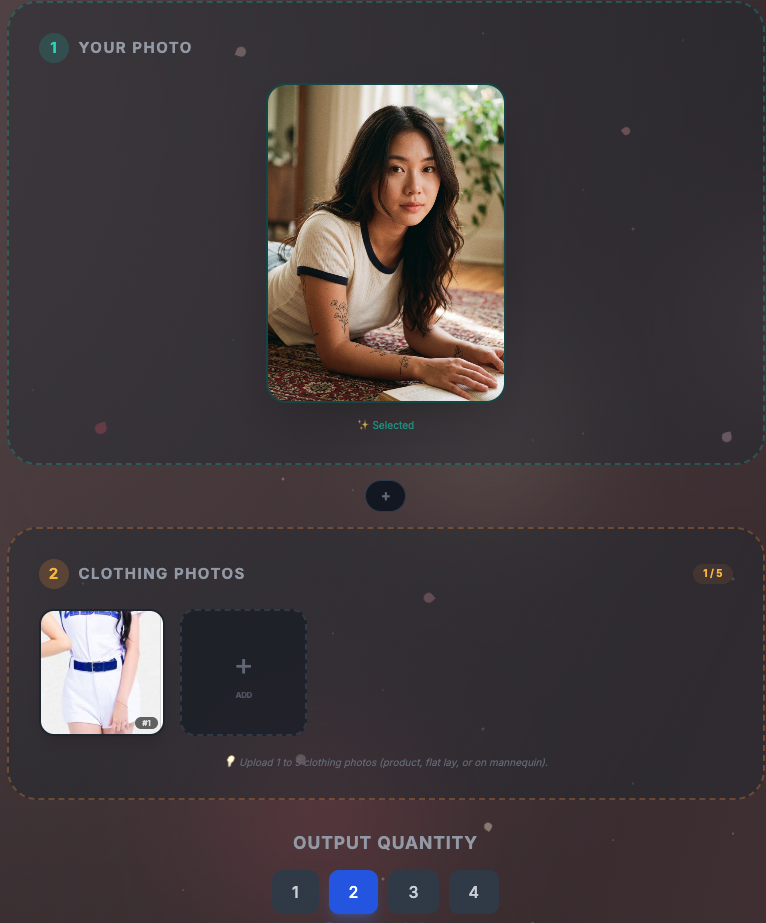

- 範例中，上半段顯示：
  - **YOUR PHOTO**：一張單人躺在地毯上的照片，作為試穿的基礎人物照。
  - **CLOTHING PHOTOS**：右下方上傳一件服裝照片，介面顯示目前已上傳件數（例如 `1/5`）。
- 下方 **OUTPUT QUANTITY** 可選擇一次要輸出的試穿結果張數（1～4 張）。

#### 6.3.2 產出多套試穿結果

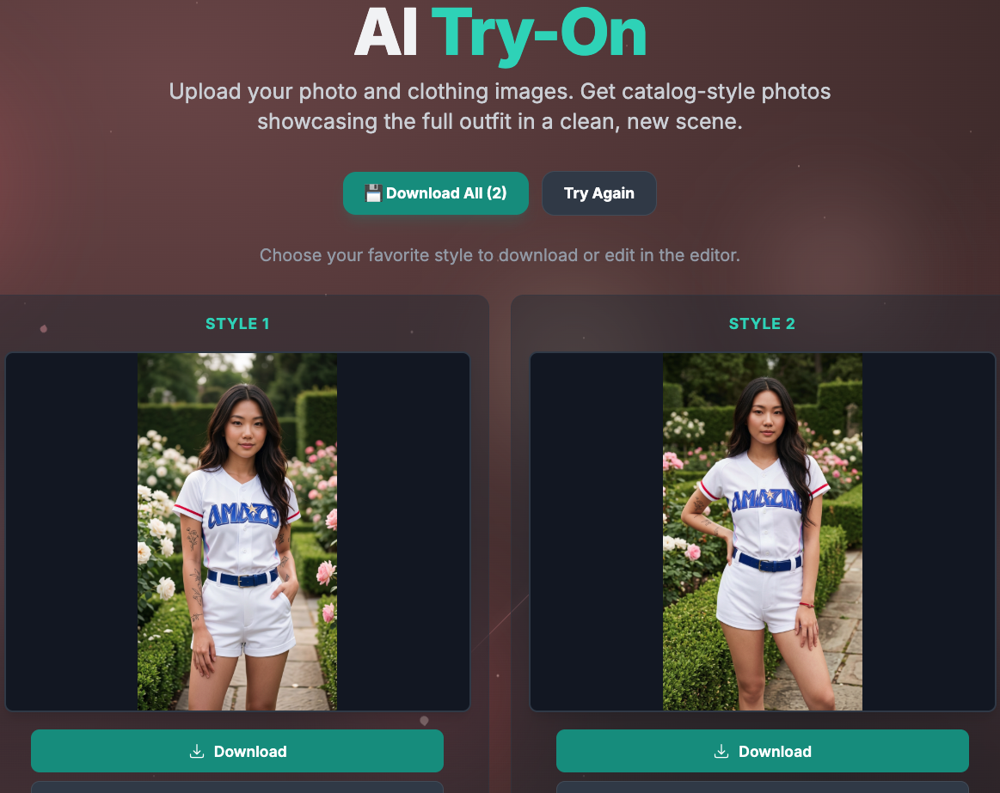

- 生成後畫面會顯示標題 **AI Try-On**，並列出多個風格卡片：
  - 頂部有 **Download All** 與 **Try Again** 按鈕，方便一次下載全部或重新生成。
  - 每張卡片標示 **STYLE 1、STYLE 2…**，並搭配對應的服裝與場景。
  - 卡片下方提供 **Download** 按鈕，可單獨下載每一張試穿結果。
- 建議流程：
  1. 先用少量服裝測試，確認人物與服裝融合自然。
  2. 確定風格可信後，再批量上傳更多服裝並增加輸出張數。

---

## 7. 建議的學習路徑

1. **先從 Generate 練習提示詞**
   - 學會如何用簡短描述控制風格與構圖。
2. **再進入 ID Photo / Portrait / Travel / Try On 等結構化表單**
   - 熟悉各欄位對結果的影響。
3. **最後使用編輯器微調細節**
   - 利用修圖、濾鏡與裁切，打造最終成品。

---

## 8. 後續可擴充的章節建議

- Start 畫面與多分頁導覽總覽。
- 主題寫真（Themed）、雙人／團體照（Couple / Group）更完整的範例流程。
- 設定頁（Settings）與多語系（English / 繁體中文）切換教學。
- 錯誤訊息與常見問題（例如：API Key 未設定、配額不足等）。

> 後續若在 `images/` 裡新增更多對應模組的截圖，可以比照上述結構，繼續為其它功能撰寫分章，逐步擴充成完整的 BloomRender 使用指南。
